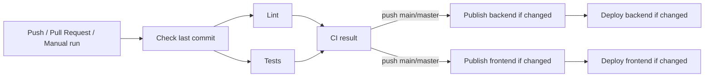
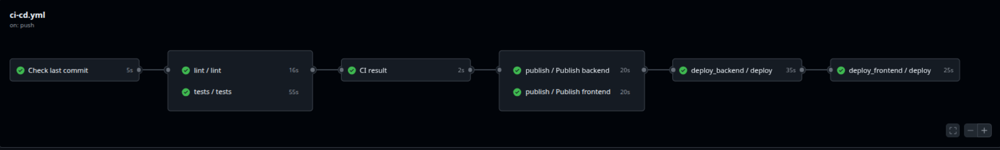
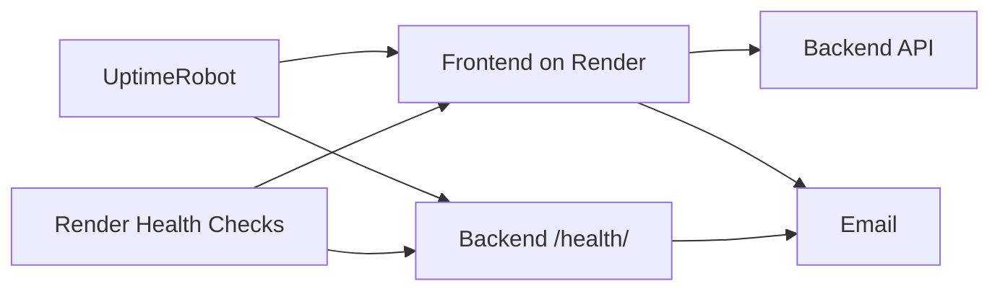

# Junior DevOps тестовое задание

Проект организован как **монорепозиторий**: backend, frontend, конфигурация контейнеризации и CI/CD находятся в одном Git-репозитории. При этом backend и frontend разворачиваются как два независимых сервиса и для каждого собирается отдельный Docker-образ.

*Стек*:
- **Backend** — FastAPI + Uvicorn.
- **Frontend** — статические HTML/CSS/JS-файлы, отдаваемые через Nginx.

Docker используется для воспроизводимого запуска приложения в локальной среде, CI и production. Образы backend и frontend собираются независимо, это позволяет обновлять сервисы отдельно друг от друга.

Workflow **GitHub Actions** запускается в трёх случаях:

- при `push` в ветки `main` или `master`;
- при `pull_request` в `main` или `master`;
- вручную через `workflow_dispatch`.

Перед запуском основных этапов job-а **Check last commit** определяет, какие части монорепозитория изменились в последнем коммите. Если изменения затронули `backend/`, `frontend/`, `tests/e2e/`, `compose.yaml` или сами workflow-файлы, запускаются необходимые проверки.

На этапе **Lint** проверяется стиль Python-кода с помощью Black, isort и Flake8, а frontend — с помощью Prettier и ESLint. Параллельно выполняются автоматические тесты: backend-тесты на Pytest и интеграционные проверки приложения в Docker Compose, включая Selenium.

Для **Pull Request** выполняются только CI-проверки — определение изменений, lint и tests. Публикация Docker-образов и deploy намеренно отключены условием `github.event_name != 'pull_request'`. Таким образом, код проверяется до merge, но изменения из Pull Request не попадают в production.

После успешного CI на `push` в `main` или `master` GitHub Actions собирает и публикует Docker-образы в **Docker Hub**, после чего выполняется deploy соответствующих сервисов в **Render**.

### Выборочная пересборка и deploy

Pipeline учитывает структуру монорепозитория и не пересобирает все сервисы при каждом изменении.

- Если в последнем коммите изменился только `backend/`, пересобирается и публикуется только backend, после чего выполняется только его deploy.
- Если изменился только `frontend/`, пересобирается и разворачивается только frontend.
- Если изменились обе части, обновляются оба сервиса.
- Изменения в `tests/e2e/` или `compose.yaml` запускают проверки, но сами по себе не требуют пересборки backend или frontend.
- Изменения в `.github/workflows/` заставляют повторно проверить обе части pipeline.

Это сокращает время CI/CD и исключает ненужные сборки и деплои сервисов, код которых не изменялся.

> Технически текущая реализация сравнивает `HEAD~1` и `HEAD`, то есть определяет изменения именно **в последнем коммите**, а не во всём наборе изменений Pull Request. 

Секретные значения (например: Docker Hub token, Render API key, Deploy Hooks) хранятся в **GitHub Secrets**, а несекретные URL и идентификаторы сервисов — в **GitHub Variables**.

Я выбрал такой набор инструментов из-за простоты и воспроизводимости: GitHub Actions (проще чем Jenkins + я решил выложить на GH), Docker изолирует окружение приложения, Docker Hub используется как registry, а Render позволяет разворачивать контейнеры без настройки собственной серверной инфраструктуры.

## Базовый мониторинг доступности

Для production-сервисов можно использовать мониторинг в два уровня:

1. **Render Health Checks** — внутренняя проверка состояния сервисов. Для backend используется endpoint `/health/`, для frontend можно проверять `/`. Это позволяет платформе обнаруживать проблемы с запущенным приложением.

2. **UptimeRobot** — внешняя проверка доступности. Отдельные HTTP-мониторы периодически проверяют публичный URL frontend и backend `/health/`. При недоступности сервиса или ошибочном HTTP-ответе отправляется уведомление, например по email.

Такое сочетание предпочтительнее использования только внутренней проверки Render: health check показывает состояние сервиса внутри инфраструктуры платформы, а внешний монитор дополнительно подтверждает, что приложение действительно доступно пользователю из Интернета.

- Render uptime best practices: https://render.com/docs/uptime-best-practices

