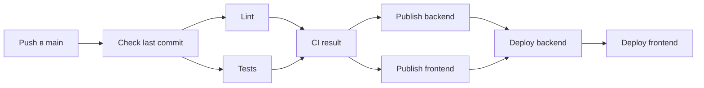
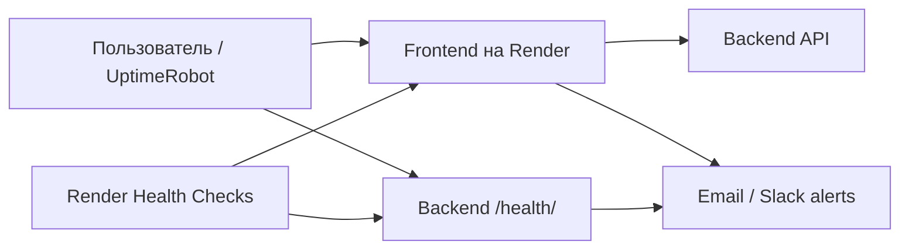

# Краткое описание CI/CD и мониторинга

## CI/CD pipeline

Проект организован как **монорепозиторий**: backend, frontend, конфигурация контейнеризации и CI/CD находятся в одном Git-репозитории. При этом backend и frontend разворачиваются как два независимых сервиса и для каждого собирается отдельный Docker-образ.

*Стек*:
- **Backend** — FastAPI + Uvicorn.
- **Frontend** — статические HTML/CSS/JS-файлы, отдаваемые через Nginx.

Docker используется для воспроизводимого запуска приложения в локальной среде, CI и production. Образы backend и frontend собираются независимо, что позволяет обновлять сервисы отдельно друг от друга, сохраняя единый репозиторий исходного кода.

Workflow GitHub Actions запускается в трёх случаях:
- при push в ветки main или master;
- при pull_request в main или master;
- вручную через workflow_dispatch.

Текущий workflow **GitHub Actions** запускается при `push` в ветку `main`. Последовательность шагов следующая:

На этапе **Lint** проверяется стиль Python-кода с помощью Black, isort и Flake8, а frontend — с помощью Prettier и ESLint. Параллельно запускаются автоматические тесты: backend-тесты на Pytest и интеграционные e2e-тесты в Docker Compose, при помощи Selenium.

После успешного завершения CI GitHub Actions собирает Docker-образы backend и frontend и публикует их в **Docker Hub** с тегами `latest` и SHA текущего commit. Далее запускается deploy сервисов в **Render**, после чего выполняются проверки доступности приложения.

Секретные значения (например: Docker Hub token, Render API key, Deploy Hooks), хранятся в **GitHub Secrets**, а несекретные URL и идентификаторы сервисов — в **GitHub Variables**.

> **Важно:** в текущей конфигурации `pull_request` не является триггером workflow — CI/CD запускается только на `push` в `main`. Поэтому lint и tests на Pull Request сейчас отдельно не выполняются. При необходимости это можно добавить как отдельный CI-триггер, оставив публикацию образов и deploy только для `push` в `main`.

### Фактический запуск pipeline

Ниже показан успешный запуск workflow в GitHub Actions: lint и tests выполняются параллельно, затем параллельно публикуются образы backend и frontend, после чего выполняется deploy.

Я выбрал такой набор инструментов из-за простоты и воспроизводимости: GitHub Actions (проще чем Jenkins + я решил выложить на GH), Docker изолирует окружение приложения, Docker Hub используется как registry, а Render позволяет разворачивать контейнеры без настройки собственной серверной инфраструктуры.

## API-документация

Backend написан на FastAPI, поэтому для API доступна автоматически сгенерированная Swagger UI. В проекте документация настроена не на стандартный `/docs`, а на путь:

`/api/docs`

`https://jobmatch-backend-j3zv.onrender.com/api/docs`

## Базовый мониторинг доступности

Для production-сервисов я бы использовал мониторинг в два уровня:

1. **Render Health Checks** — внутренняя проверка состояния сервисов. Для backend используется endpoint `/health/`, для frontend можно проверять `/`. При проблемах Render может определить instance как unhealthy и перезапустить его.

2. **UptimeRobot** — внешняя проверка доступности. Отдельные HTTP-мониторы периодически проверяют URL frontend и backend `/health/`. При недоступности или ошибочном HTTP-ответе отправляется уведомление, например по email.

Такое сочетание предпочтительнее использования только Render Health Checks: внутренний health check показывает состояние приложения внутри Render, а внешний монитор дополнительно проверяет, доступен ли сервис с точки зрения внешнего пользователя.

### Полезные ссылки

- Render Health Checks: https://render.com/docs/health-checks
- Render uptime best practices: https://render.com/docs/uptime-best-practices
- UptimeRobot: https://uptimerobot.com/
